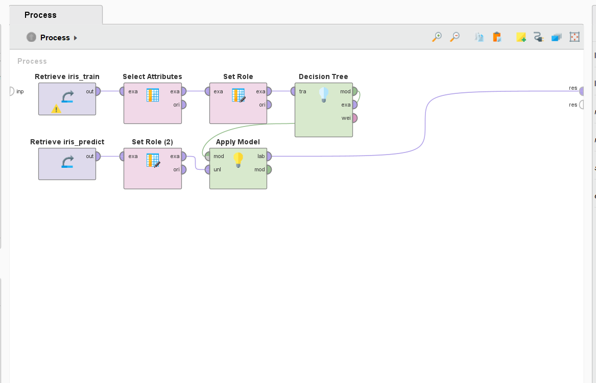

# CIDM 6355 – HW1 Decision-Tree Analysis

## Assignment Summary

For this assignment, I worked with iris training and prediction datasets in RapidMiner. I created a decision-tree model using the training data and then applied the model to a separate prediction dataset.

## RapidMiner Process

My process included:

1. Retrieving the iris training dataset
2. Selecting the required attributes
3. Setting the species field as the label
4. Creating a decision-tree model
5. Retrieving the iris prediction dataset
6. Setting the roles for the prediction data
7. Applying the completed model to the new records
8. Reviewing the prediction results

## What I Learned

This assignment helped me understand the difference between training data and prediction data. The training data contained known species that were used to create the model, while the prediction data contained new records for the model to classify.

I can follow a guided RapidMiner process and understand the general purpose of each step. I still need instructions and examples when creating a complete process, selecting model settings, and troubleshooting errors.
